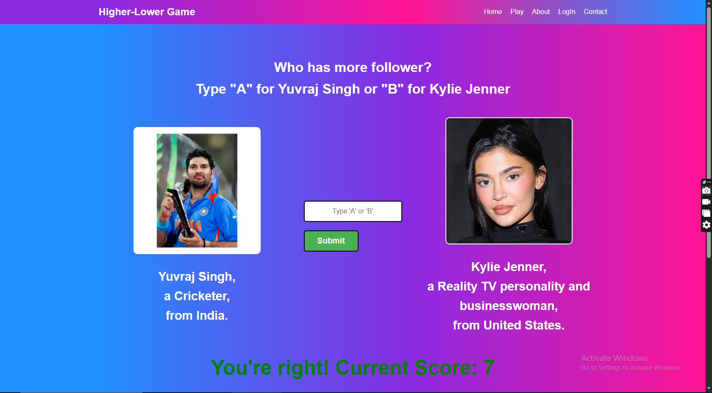

# 🕹️ Game Project - "Who Has More Followers?"

Welcome to the **Django-based Follower Comparison Game**!  
Users are shown **two random profiles**, and they must guess which one has more followers.  
Every correct guess boosts your score. Every wrong guess resets the game.

---

# 🎯Game Preview
 
 
 

## 🚀 Features

- 🔄 Random profile comparison every time
- ✅ Real-time score tracking using Django sessions
- 🔍 Compare accounts based on:
  - Name
  - Description
  - Country
  - Profile image
  - Follower count
- 🎮 Fun & interactive UI
- 🛠️ Admin panel to upload new profiles

---

## 🧠 How It Works

1. Users visit the **home page** and start playing.
2. Two profiles appear (Account A vs Account B).
3. User picks one.
4. If correct ➡️ score increases.
5. If wrong ➡️ score resets to zero.
6. Game continues infinitely (until user fails!).

---

## 📂 Project Structure

- `gameApp/views.py`: Game logic, score session, random profile generation.
- `models.py`: Upload model to store account data (name, description, image, country, followers).
- `templates/`: All HTML files — home, play, about, contact.
- `media/`: Uploaded images for profiles.

---

## 🧩 Getting Started

Follow the steps below to set it up locally after cloning or downloading:

### 1️⃣ Setup Virtual Environment

```bash
python -m venv venv
source venv/bin/activate  # or venv\Scripts\activate (Windows)
````

### 2️⃣ Install Requirements

```bash
pip install django
```

### 3️⃣ Create Database

Since database was deleted:

```bash
# Inside the project root (same level as manage.py)
python manage.py makemigrations gameApp
python manage.py migrate
```

> Make sure your `Upload` model is already defined in `models.py`.

---

## 🛠️ Run the Server

```bash
python manage.py runserver
```

Visit `http://127.0.0.1:8000/` to start playing the game 🎉

---

## 🔑 Admin Access

To upload new profile entries:

```bash
# Create admin superuser
python manage.py createsuperuser
```

Then go to `http://127.0.0.1:8000/admin/` and log in.

---

## 📸 Profile Upload Guidelines

Every profile should include:

* Name
* Description
* Country
* Follower count (integer)
* Profile image (uploaded via admin)

---

## ✨ Future Ideas

* Add difficulty levels (Easy, Medium, Hard)
* Track high scores globally
* Add social media logins for sharing scores
* Create API endpoint for mobile app

---

## 🧑‍💻 Made With

* Django 💡
* Sessions
* HTML/CSS 🎨
* Python 🐍

---

## 🤝 Contributing

Pull requests are welcome!
Open issues, suggest features, or just say 👋 in the discussions.

---

## 📃 License

This project is open-source and free to use under the [MIT License](LICENSE).

---


> **⚠️ Note:** The follower counts shown in the game are not real-time and might be outdated.  
> They are stored statically in the database, so don't be surprised if the actual numbers on social media are different! 😉

##

🎯 **Have fun playing and guessing!**
